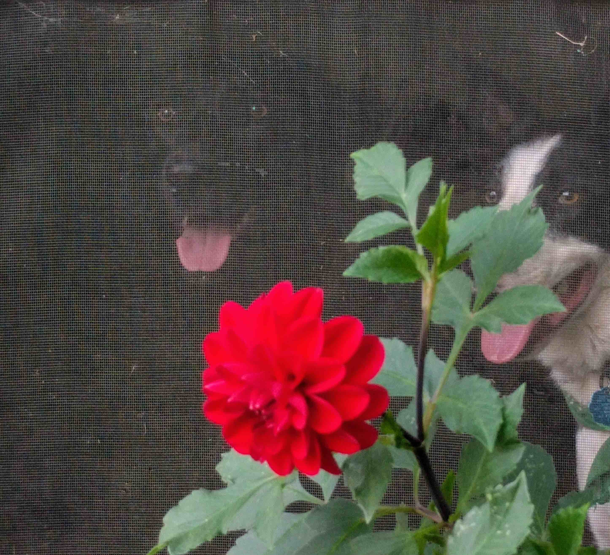

   
# Colton Grainger

This is the personal website of Colton Grainger.

I am coordinating the [volunteer program](http://coltongrainger.com/fscss-volunteers) for a family homeless shelter in Olympia, WA. 

Additionally, I am reviewing [Probabilty](http://webpages.uidaho.edu/cremien/math451EO/) and [Ordinary Differential Equations](http://www.webpages.uidaho.edu/~barannyk/Teaching/Math310.html).

## Recent Posts


  <a href="{{ post.url }}">{{ post.title }}</a>  {{ post.date | date: "%Y-%m-%d"}} 


## Contact

- Email: [colton.grainger@gmail.com](mailto:colton.grainger@gmail.com)
- Twitter: [@coltongrainger](https://twitter.com/coltongrainger)
- Here's my <a href="images/ccg-profile.png">photo</a>.
