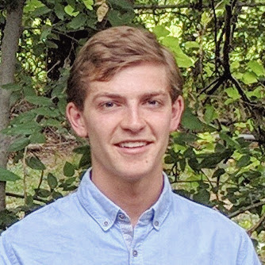

 
## Greetings!

My professional interests include social justice, permaculture, and ecological design. 

I have academic enthusiasm for 
- *Multiscale Analysis and Computations* to understand complex systems (e.g., aquifers) and
- *Numerical Methods* to model fluid flow and contaminant diffusion in porous media.

## My Current Position

I am now a clerk at a refugee resettlement office in Houston. I work on a small team to support refugees with complex medical conditions. In this work, I help limited English proficiency clients navigate one of the nation's densest health-care bureaucracies, I coordinate health plans to ensure coverage of medical services, and I accompany clients to safety nets (e.g., shelters and food pantries) in emergency situations.
