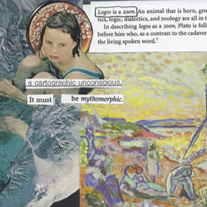

**2018: Volunteer Program Website** [(link)](https://github.com/ColtonGrainger/fscss-volunteers)  
I built a website to coordinate volunteer recruitment and scheduling at Family Support Center of South Sound.

**2017: Case Management Bulletin Board** [(link)](https://github.com/ColtonGrainger/ymca-resources)  
I created a repository for case managers at the YMCA International Services in Houston, TX. We supported refugees with complex medical conditions in one of the nation’s largest health-care centers.

**2016: Galois Theory for Differential Equations** [(pdf)](documents/cgrainger_coursework_galois.pdf) [(poster)](documents/cgrainger_coursework_galois_poster.pdf) 
Following Michio Kuga's analysis of Fuchsian-type differential equations, I parameterize the solution space of the hypergeometric equation. For interesting cases, I find the monodromy representation at singular points. Presented at the College of Idaho's Student Research Conference.

**2014: Animal Magnetism** [(pdf)](documents/cgrainger-animal-magnetism.pdf)  
In a series of collages, I explore the human/animal bodies in William Faulkner's *As I Lay Dying*. Created for Dr. Scott Knickerbocker.

