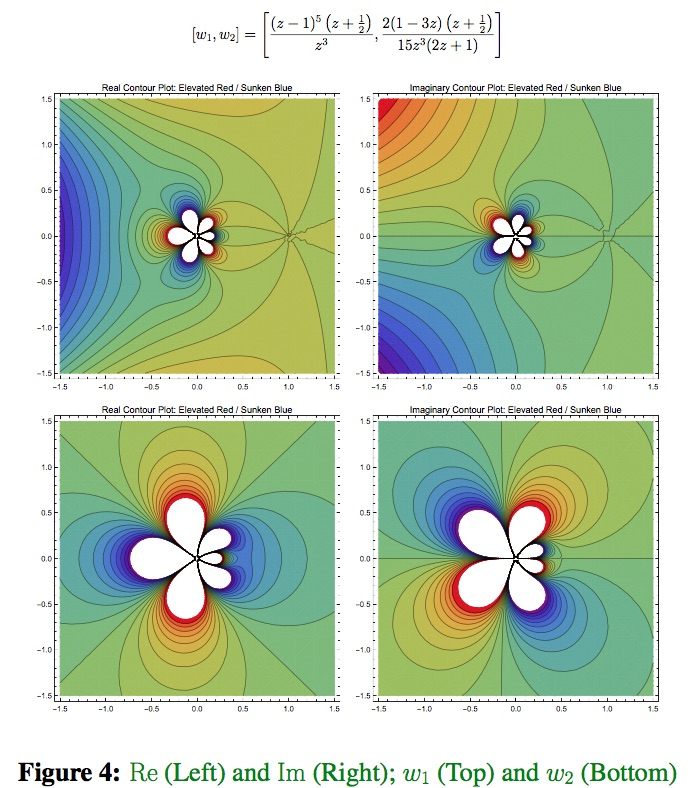

## Refugee Services in Houston 

+ [Case Management Bulletin Board](https://github.com/ColtonGrainger/ymca-resources)
+ [Map of Primary Care Providers](https://drive.google.com/open?id=1kk9yn6-4nifHLIf2tGYbW_7PiYo&usp=sharing)
+ [Map of Shelters](https://drive.google.com/open?id=1DlnGODIVZdoQ_O2P2CK_oXOZkZQ&usp=sharing)

## Blogs

[Episcopal Service Corps Blog](https://texas-esc.org/components/blog/)

## Written Work

+ Galois Theory for Differential Equations [(pdf)](documents/cgrainger_coursework_galois.pdf) [(poster)](documents/cgrainger_coursework_galois_poster.pdf)
+ Practice, Project, Power: Journal Keeping with an Emphasis on Emperical Observation [(pdf)](documents/cgrainger_coursework_journalkeeping.pdf)

