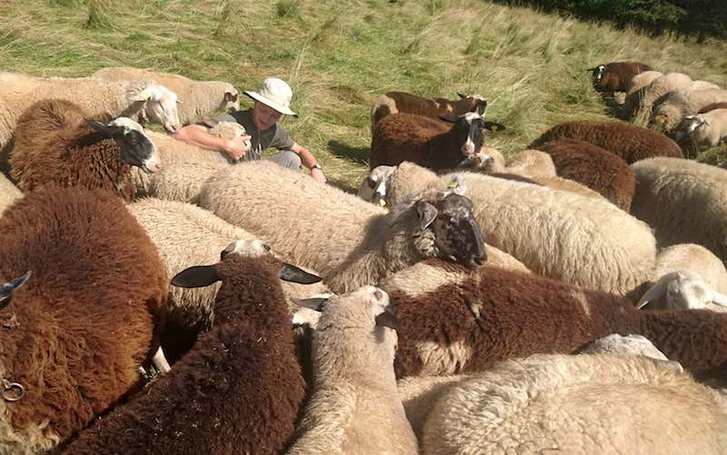
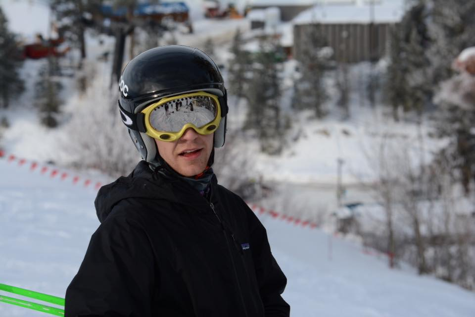

## Education

**B.S. in Mathematics-Physics**, _May 2016_  
The College of Idaho   

## Experience

## Summary

**Clerk — Refugee Medical Care**  
_September 2016 -- July 2017_  
YMCA International Services  

**WWOOF Ranch-Hand**  
_June 2016 -- August 2016_ 
Sonnwendhof Biofarm 

<<<<<<< HEAD
=======
**B.S. in Mathematics-Physics**, _May 2016_  
The College of Idaho   

>>>>>>> refs/remotes/origin/master
**Grading Assistant**  
_September 2015 -- December 2015_  
The College of Idaho  

<<<<<<< HEAD
## Community Involvement
=======
## Photos

 
Möckmühl, *July 2016*

 
Urquhart Castle, *June 2016*

 
Bogus Basin, *January 2015*

>>>>>>> refs/remotes/origin/master

**Service Corps Fellow** 
_August 2016 -- July 2017_ 
Texas Episcopal Service Corps

